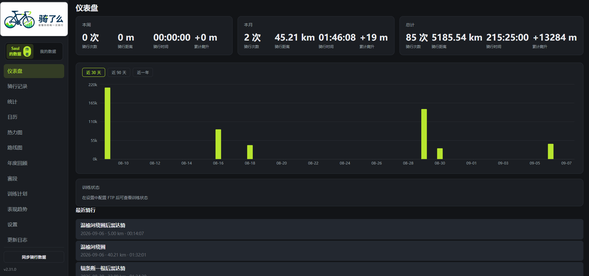
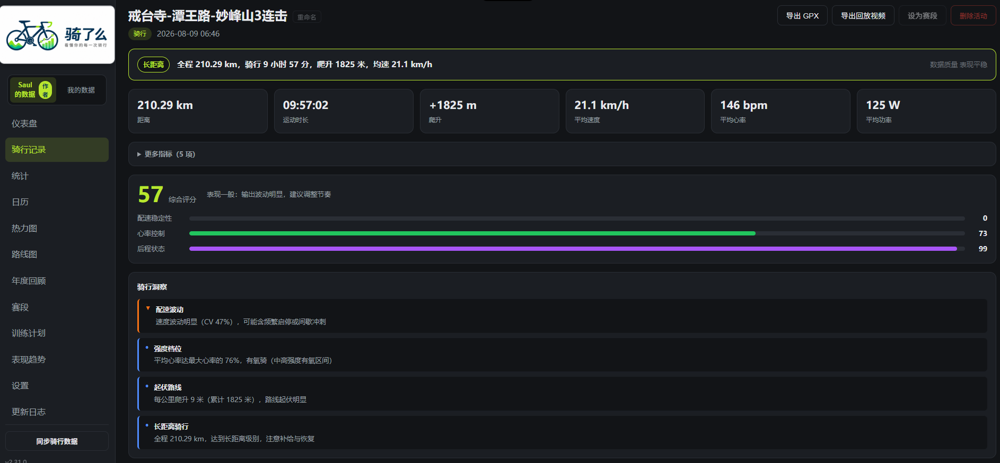
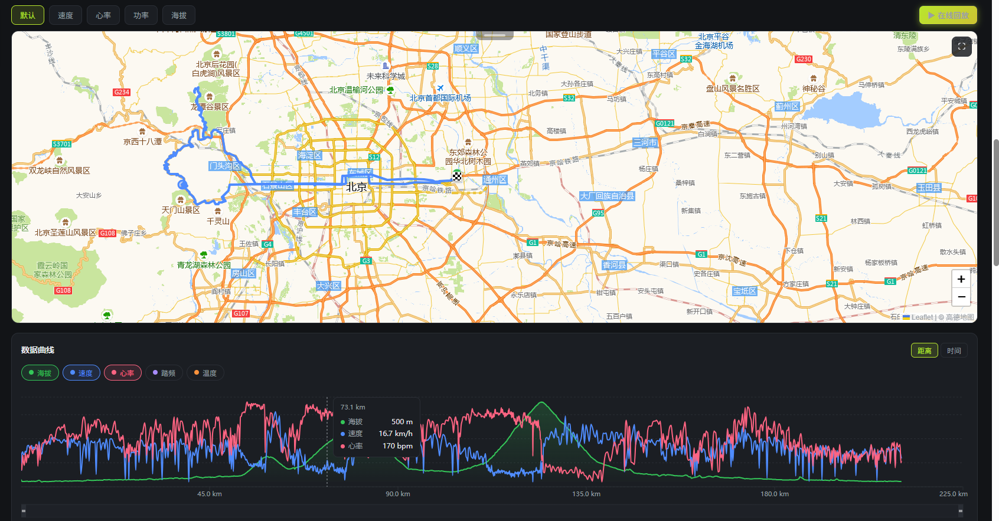
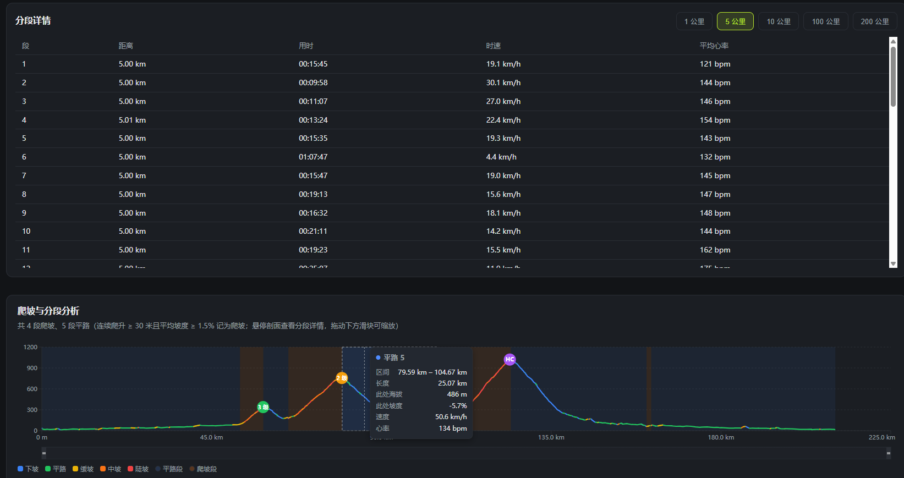
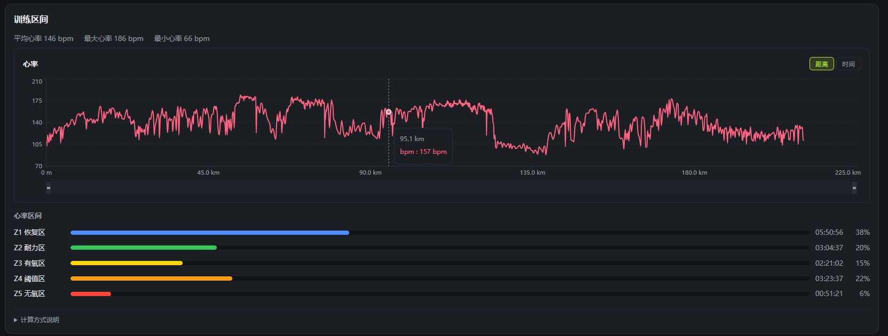
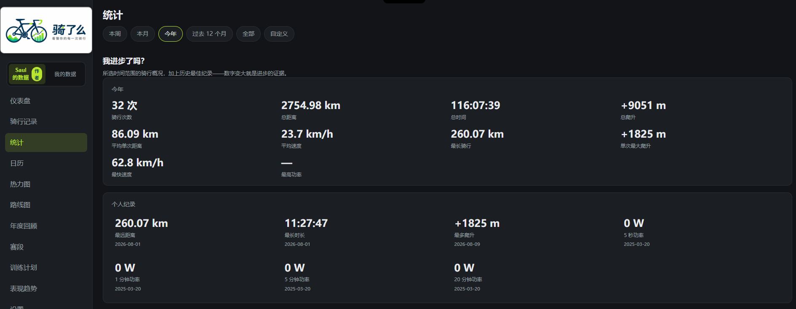
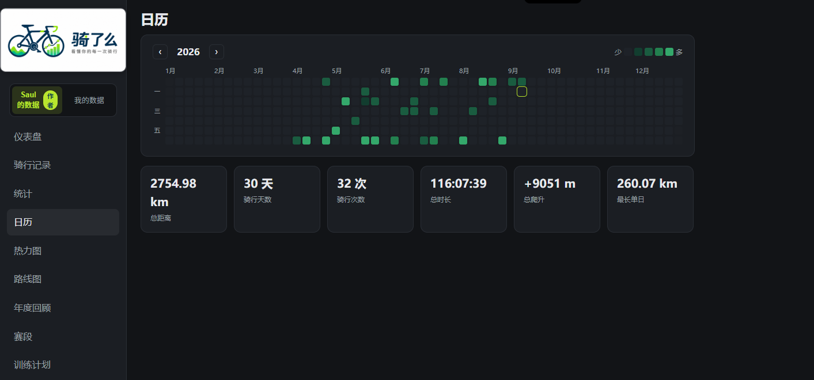
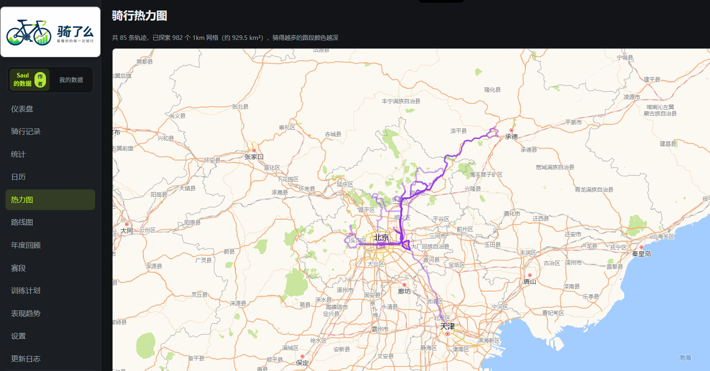
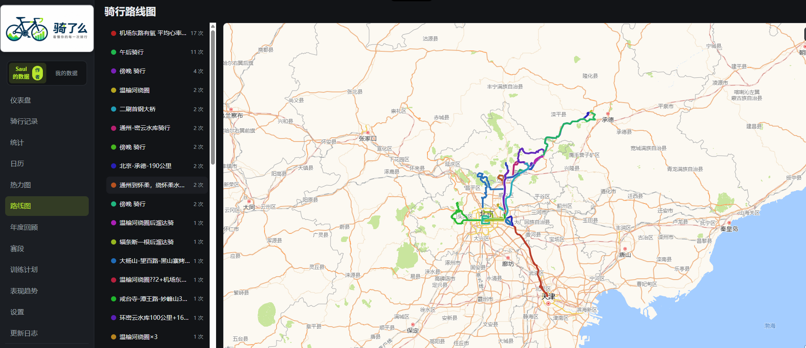
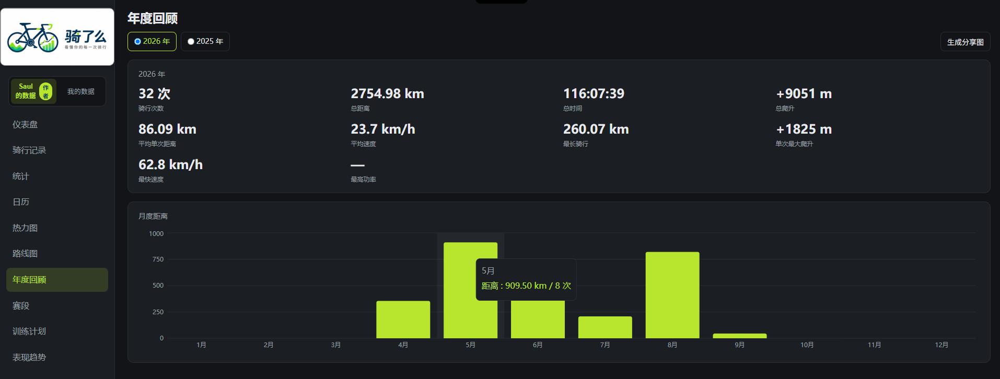

# 骑了么（Cycling Analyzer）

> 看懂你的每一次骑行


一个纯前端骑行数据分析网站（**Strava Lite**）：默认展示作者 Saul 公开发布的骑行数据（只读），你也可以导入自己的 `.fit` 文件——你的数据只保存在浏览器本地（IndexedDB），**不上传任何服务器**。

将 Garmin / Wahoo / COROS 等设备产生的 `.fit` 骑行文件导入浏览器，在本地完成 FIT 解析、数据统计、轨迹展示、骑行记录管理和历史趋势分析。

**在线地址**：https://999bug.github.io/cycling-analyzer/

## 界面预览

> 以下截图基于作者 Saul 的真实骑行数据（深色主题）。

**仪表盘**（本周 / 本月 / 总计核心指标 + 30/90/365 天距离趋势 + 训练状态 + 最近骑行）



**骑行记录**（排序 / 搜索 / 月份与类型筛选 / 高级数值筛选 / 分页）



**数据地图**（轨迹按默认 / 速度 / 心率 / 功率 / 海拔分段着色一键切换，下方多指标曲线与地图联动缩放）



**分段详情与爬坡分析**（1 / 5 / 10 / 200 公里分段用时表 + 自动识别爬坡段，海拔图上直接查看坡度、速度与心率）



**训练区间**（心率曲线 + Z1~Z5 区间时长与占比，基于 FTP 与最大心率计算）



**活动对比**（同路线两次骑行轨迹叠加，距离 / 时长 / 均速 / 心率 / 功率逐项对比，进步一目了然）


**统计**（6 种时间范围 + 个人纪录 / 设备统计 / 路线分析）



**骑行日历**（GitHub 风格热力图，按距离 5 档着色，点击查看当日活动）



**骑行热力图**（全部轨迹叠加 + 1km 网格覆盖统计，骑过的地方都亮起来）



**路线图**（相似轨迹自动归组，按骑行次数配色，常骑路线一眼看出）



**年度回顾**（年度指标 + 月度距离分布 + 一键生成分享图）



**数据导入**（三种方式：Strava 导出目录自动还原标题 / 描述 / 估算功率、其他设备目录、拖拽单文件——全部在浏览器本地解析，不上传任何服务器）


**在线回放**（轨迹动画复现骑行过程，1x ~ 128x 变速播放，实时显示时间 / 距离 / 速度）


**导出**（一键导出 GPX 供其他平台使用，或导出回放视频直接发社交平台；详情页自带智能报告与综合评分）


## 主要功能

### 数据导入
- 三种导入方式：选择目录（File System Access API）/ 文件上传 / 拖拽
- 支持 Strava 批量导出（`.fit.gz` 自动解压），还原活动原标题、描述与估算功率
- SHA-256 指纹去重（`.fit` 与 `.fit.gz` 同一活动判重一致），重复文件自动跳过
- Web Worker 后台解析，不阻塞页面；失败文件记录原因可重试

### 骑行数据
- **仪表盘**：本周/本月/总计统计（次数/距离/时长/爬升）+ 30/90/365 天距离趋势 + 训练状态
- **骑行记录**：排序 / 搜索 / 月份与类型筛选 / 高级数值筛选（距离/爬升/功率）/ 分页
- **活动详情**：10+ 指标卡（含标准化功率）、Leaflet 轨迹地图（抽稀 + 起终点标记 + 速度/心率/功率/海拔分段着色 + 全屏）、速度/心率/海拔/功率/踏频/组合图表、功率曲线、分段 splits、训练效果、成就栏、重命名、导出 GPX、设为赛段
- **统计页**：10 项指标 + 6 种时间范围 + 个人纪录（骑行 3 项 + 功率 4 档）/ 设备统计 / 路线分析
- **骑行日历**：GitHub 风格热力图，按距离分 5 档着色，点击查看当日活动
- **热力图**：全部轨迹低透明度叠加 + 1km 网格区域覆盖统计
- **年度回顾**：按自然年汇总指标 + 月度距离分布 + Canvas 分享图（PNG 下载）
- **活动对比**：同路线两次骑行轨迹叠加 + 核心指标逐项对比（差值高亮）
- **在线回放**：轨迹动画复现骑行过程，1x~128x 变速播放，可导出回放视频
- **赛段**：起终点圆（200m）穿越匹配，成绩榜按用时排名，单活动多次穿越取最佳

### 训练分析
- 标准化功率（NP）、强度因子（IF）、训练压力（TSS）、训练效果（TE）
- 心率区间 / 功率区间（5 区间分布），基于用户配置的 FTP 与最大心率
- 训练状态（Fitness/Fatigue/Form，CTL 42 天 / ATL 7 天 EWMA 趋势）
- FTP 自动估算 / VO2Max 估算（近 90 天最佳功率推导）
- 功率曲线（11 档标准时长，1s~1h）与个人纪录

### 数据管理
- IndexedDB 本地持久化，刷新不丢失
- JSON 数据导出 / 导入备份（迁移到其他电脑）
- 公里/英里、12h/24h 单位偏好；深色/浅色主题
- 可选保存原始 FIT 文件字节
- 删除单条记录 / 清空全部数据（二次确认）

## 作者数据与隐私

- **作者数据公开**：站点默认展示作者 Saul 的骑行数据（侧栏「Saul 的数据 / 我的数据」切换器），`author-data/` 下 FIT 原始文件与生成快照（含 GPS 轨迹）随站点公开可下载——这是有意为之的公开分享
- **访客数据本地**：访客导入的骑行数据只存于当前浏览器 IndexedDB，与作者数据完全隔离，**永不离开你的设备**
- 跨活动全量扫描类功能（热力图轨迹、赛段成绩榜、功率纪录、路线分组）为构建时预计算产物，访客端无需下载全部逐点数据
- 作者更新数据：向 `author-data/fit/` 提交 `.fit`/`.fit.gz`（可选同步 `activities.csv` 还原标题/描述/估算功率），push 后 CI 自动重建快照

## 技术栈

React 19 · TypeScript · Vite · React Router · Zustand · Dexie (IndexedDB) · Leaflet · Recharts · @garmin/fitsdk · Vitest · Playwright · GitHub Actions

## 本地运行

```bash
npm install
npm run dev
```

## 构建与测试

```bash
npm run build:author-data   # 作者数据快照（解析 author-data/fit/ → public/author-data/）
npm run build               # tsc + vite build
npm run test                # 全量测试（Vitest，630+ 用例）
npx vitest run <file>       # 单文件测试
npm run test:e2e            # E2E（Playwright，首次需 npx playwright install chromium）
npm run lint                # ESLint
```

## 部署

推送 main 分支自动触发 GitHub Actions：lint → test → 构建作者数据快照 → build → 部署到 GitHub Pages（SPA 路由经 404.html 还原深链）。

## 项目文档

- [功能状态与开发进度](docs/PROGRESS.md)（进行中任务、未实现工作项、架构约定）
- [历史归档（已完成功能明细）](docs/archive/PROGRESS-archive-2026-08.md)
- [产品规格说明](docs/个人骑行数据分析网站——Agent%20开发规格说明.md)

## 开源协议

[MIT](LICENSE) © 2026 999bug —— 本项目为个人开源项目，仅供学习与个人使用。
