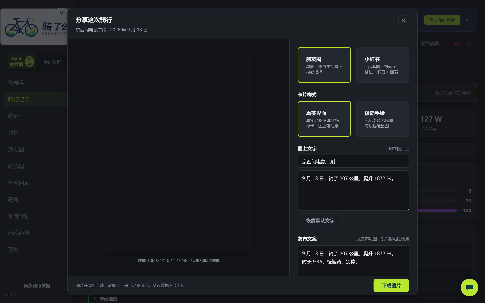
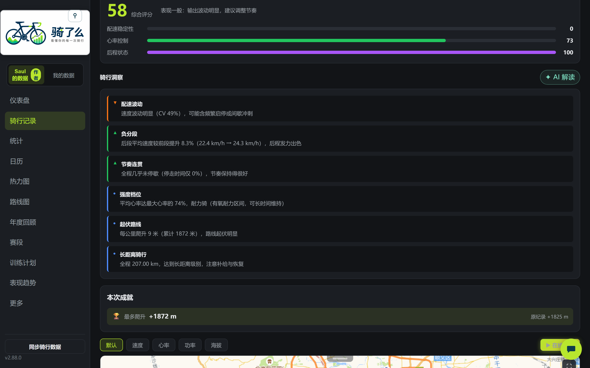
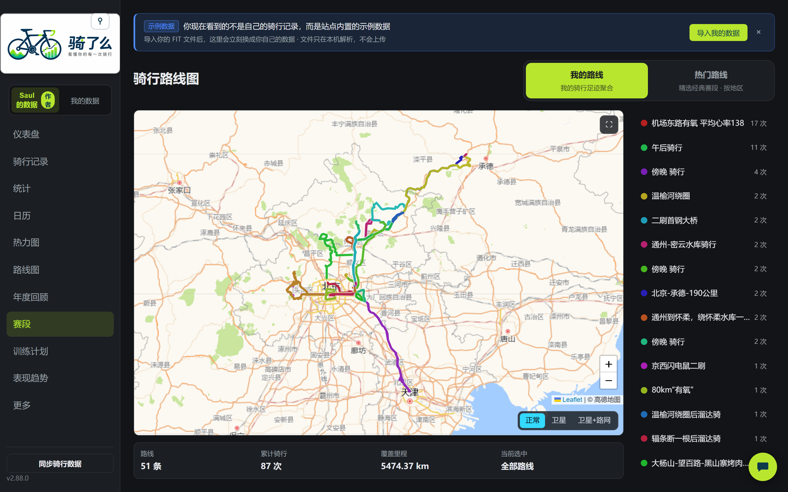
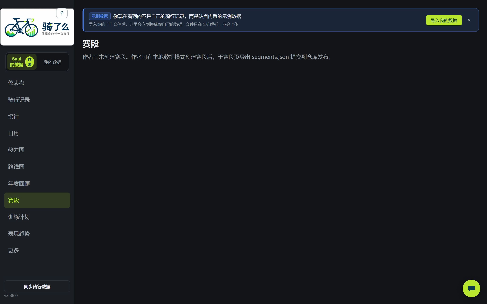
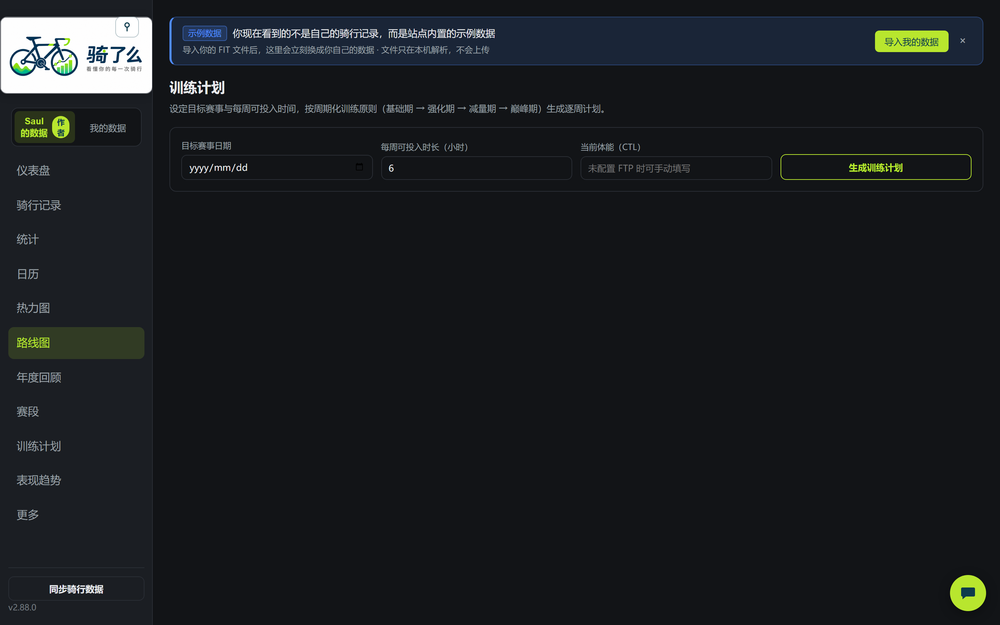
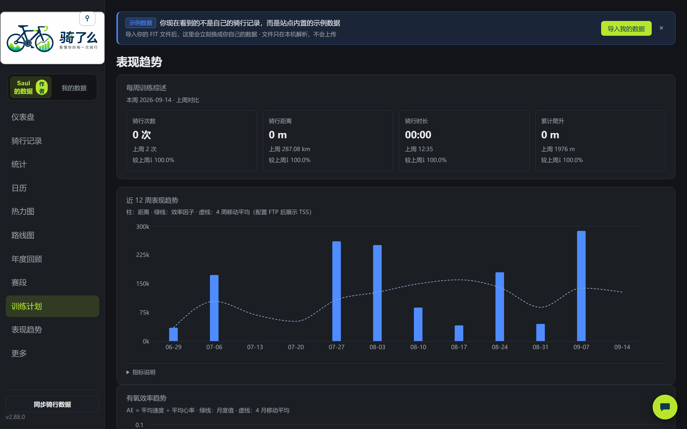
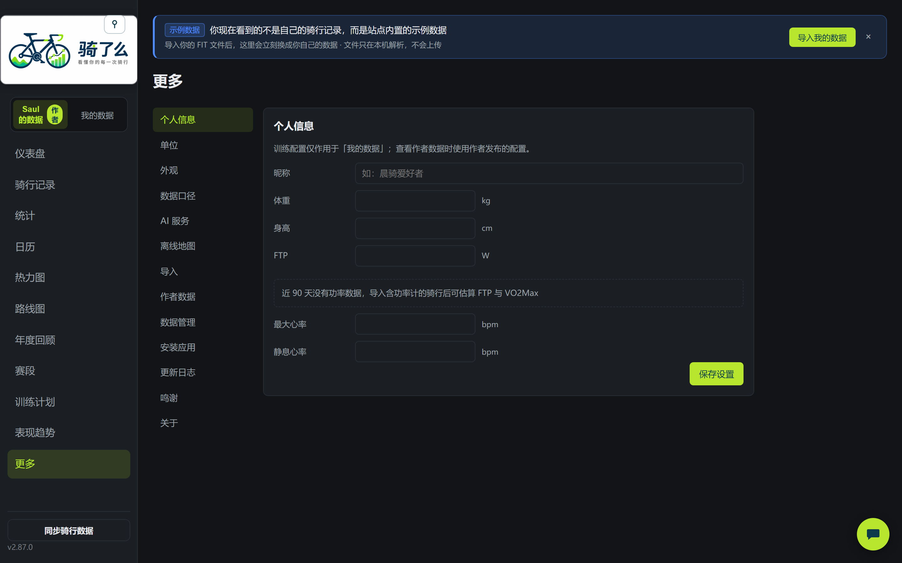

# 骑了么（Cycling Analyzer）

> 看懂你的每一次骑行


一个纯前端骑行数据分析网站（**Strava Lite**）：默认展示作者 Saul 公开发布的骑行数据（只读），你也可以导入自己的 `.fit` 文件——你的数据只保存在浏览器本地（IndexedDB），**不上传任何服务器**。

将 Garmin / Wahoo / COROS 等设备产生的 `.fit` 骑行文件导入浏览器，在本地完成 FIT 解析、数据统计、轨迹展示、骑行记录管理和历史趋势分析。

**在线地址**：https://999bug.github.io/cycling-analyzer/

## 界面预览

> 以下截图基于作者 Saul 的真实骑行数据（深色主题）。

**仪表盘**（本周 / 本月 / 总计核心指标 + 30/90/365 天距离趋势 + 训练状态 + 最近骑行）


**骑行记录**（排序 / 搜索 / 年份与月份筛选 / 自定义筛选预设 / 批量修正类型 / 分页）


**数据地图**（轨迹按默认 / 速度 / 心率 / 功率 / 海拔分段着色一键切换，下方多指标曲线与地图联动缩放）


**分段详情与爬坡分析**（1 / 5 / 10 / 200 公里分段用时表 + 自动识别爬坡段，海拔图上直接查看坡度、速度与心率）


**训练区间**（心率曲线 + Z1~Z5 区间时长与占比，基于 FTP 与最大心率计算）


**活动对比**（同路线两次骑行轨迹叠加，距离 / 时长 / 均速 / 心率 / 功率逐项对比，进步一目了然）


**统计**（6 种时间范围 + 个人纪录 / 设备统计 / 路线分析）


**骑行日历**（GitHub 风格热力图，按距离 5 档着色，悬浮即看当日详情）


**骑行热力图**（全部轨迹叠加 + 1km 网格覆盖统计，骑过的地方都亮起来）


**路线图**（相似轨迹自动归组，按骑行次数配色，常骑路线一眼看出）


**年度回顾**（年度指标 + 月度距离分布 + 一键生成分享图）


**数据导入**（三种方式：Strava 导出目录自动还原标题 / 描述 / 估算功率、其他设备目录、拖拽单文件——全部在浏览器本地解析，不上传任何服务器）


**在线回放**（轨迹动画复现骑行过程，1x ~ 128x 变速播放，实时显示时间 / 距离 / 速度）


**导出**（一键导出 GPX 供其他平台使用，或导出回放视频直接发社交平台；详情页自带智能报告与综合评分）


**分享素材**（一键把这次骑行生成可直接发朋友圈 / 小红书的图文，图片在本机绘制）



**AI 智能解读**（自带 Key 可选开启：洞察 / 综合评分 / 本次赛段可生成叙事解读，思考过程实时流式展示）



**热门路线**（17 个地区 258 条经典路线，含京郊爬坡与全国知名坡段，里程爬升带来源等级标注）



**赛段**（起终点圆穿越匹配自动计时，成绩榜按用时排名；详情页顶部展示「本次赛段」与个人最好成绩对比）



**训练计划**（基于近期负荷生成周计划，含训练状态与目标里程）



**表现趋势**（有氧效率 EF、TSS 与 4 周移动平均，看长期是否真的在进步）



**更多（设置）**（分区切换：个人信息 / 单位 / 外观 / 数据口径 / AI 服务 / 离线地图 / 导入 / 作者数据 / 数据管理 / 安装应用 / 更新日志 / 鸣谢）



## 主要功能

### 数据导入
- 三种导入方式：选择目录（File System Access API）/ 文件上传 / 拖拽
- 支持 Strava 批量导出（`.fit.gz` 自动解压），还原活动原标题、描述与估算功率
- 支持佳明 GDPR 导出包（内层 `UploadedFiles_*.zip` 递归展开，按摘要 JSON 匹配标题）
- SHA-256 指纹去重（`.fit` 与 `.fit.gz` 同一活动判重一致），重复文件自动跳过
- Web Worker 后台解析，不阻塞页面；失败文件记录原因可重试
- 导入即完成**运动类型判定**（骑行 / 跑步 / 其他），骑行统计只计骑行，误判可在列表页批量修正

### 骑行数据
- **仪表盘**：本周/本月/总计统计（次数/距离/时长/爬升）+ 30/90/365 天距离趋势 + 训练状态 + 最近骑行
- **骑行记录**：排序 / 搜索 / 年份与月份筛选 / 自定义筛选预设（可增删改、chips 展示生效条件）/ 批量修正运动类型 / 分页（每页条数记忆）
- **活动详情**：报告化首屏（一句话总结 + 核心指标精选，其余指标折叠）+ 骑行洞察 + 综合评分 + Leaflet 轨迹地图（抽稀 + 起终点标记 + 分段着色 + 全屏）+ 速度/心率/海拔/功率/踏频/组合图表 + 功率曲线 + 分段 splits + 爬坡分析 + 训练效果 + 成就栏 + 相似骑行对比 + 本次赛段 + 重命名 + 导出 GPX
- **骑行洞察**：12 类真实数据驱动的结论——后半程衰减、爬升占比、心率漂移、心率-功率耦合、配速波动、长距离、强度档位、GPS 漂移、踏频、变动指数 VI、峰值功率（1/5/20 分钟）、阈值以上时间、停走分析、地形构成
- **统计页**：10 项指标 + 6 种时间范围 + 个人纪录（骑行 3 项 + 功率 4 档）/ 设备统计 / 路线分析，按「我进步了吗 / 我骑什么路线 / 我用什么设备」三章组织
- **骑行日历**：GitHub 风格热力图，按距离分 5 档着色，悬浮显示当日详情卡（距离/时长/爬升/均速/心率/功率），点击查看当日活动
- **热力图**：全部轨迹低透明度叠加 + 1km 网格区域覆盖统计
- **年度回顾**：按自然年汇总指标 + 月度距离分布 + Canvas 分享图（PNG 下载）
- **活动对比**：同路线两次骑行轨迹叠加 + 核心指标逐项对比（差值高亮）
- **在线回放**：轨迹动画复现骑行过程，1x~128x 变速播放，可导出回放视频
- **赛段**：起终点圆（200m）穿越匹配，成绩榜按用时排名，单活动多次穿越取最佳；详情页「本次赛段」自动对比个人最好成绩（新纪录 / 前三名次 / 快慢差值）；支持地图框选建段（轨迹上点两点截取任意路段、选正反方向、预览近 90 天命中）；**本地挖掘推荐**——自动找出被多次穿越的 0.3~1.2km 高频路段并推荐建段（纯本地算法，与既有赛段重合的自动过滤）
- **热门路线**：17 个地区 258 条精选经典路线（北京 20 条 + 全国 16 地区 238 条，含京郊爬坡与全国知名坡段），地图 + 地区筛选 + 卡片网格 + 详情侧栏，里程爬升带三级来源标注（官方口径 / 权威媒体 / 社区码表），几何统一由脚本从 OSM 路网生成

### 训练分析
- 标准化功率（NP）、强度因子（IF）、训练压力（TSS）、训练效果（TE）
- 心率区间 / 功率区间（5 区间分布），基于用户配置的 FTP 与最大心率
- 训练状态（Fitness/Fatigue/Form，CTL 42 天 / ATL 7 天 EWMA 趋势）与关键指标 tooltip 说明
- 训练计划（基于近期负荷生成周计划）、表现趋势（有氧效率 EF、TSS 与 4 周移动平均）
- FTP 自动估算 / VO2Max 估算（近 90 天最佳功率推导）
- 功率曲线（11 档标准时长，1s~1h）与个人纪录

### AI 智能解读（BYOK，可选）
- **你自己的 Key**：无后端代理，浏览器直连服务商；预设 DeepSeek / 智谱 GLM / Kimi / OpenRouter / OpenAI / Claude / 通义千问 / 魔搭 等，也支持自定义 OpenAI 兼容端点
- **多供应商配置**：可添加多套配置一键切换生效，接口地址与模型清单内置
- **四类解读**：骑行洞察 / 综合评分 / 本次赛段 / 分享文案，均可在本地结论与 AI 版本间来回切换、反复重新生成；AI 版按活动缓存，重进页面直接可看
- **Agent 式流式交互**：思考过程实时展示、完成后折叠回看，正文流式落框
- **零数据外泄**：AI 上文只有聚合指标与本地结论，**GPS 轨迹点与逐点序列不出本机**；未配置 Key 时全部 AI 入口不渲染
- 设置页提供「诊断日志」（最近 200 条调用留痕，只看失败 / 复制 / 清空，不含提示词与 Key）

### 分享与导出
- **分享素材**：一键生成朋友圈（1 图）与小红书（4 页套图：封面 / 路线 / 洞察 / 图表）两种规格，两种样式——「真实界面」直接复用站内真实地图、轨迹与卡片排版（跟随主题），「极简手绘」纯 Canvas 绘制、无底图零网络请求，快照不可用时自动降级到后者
- **视频导出**：网页内录制真实页面合成 9:16 竖屏 1080×1920（比例 / 时长 / 底图 / 字幕均可选，字幕可自定义），失败自动回退内置 canvas 自绘
- **GPX 导出**：活动详情页一键导出，供其他平台使用

### 数据管理
- IndexedDB 本地持久化，刷新不丢失
- JSON 数据导出 / 导入备份（迁移到其他电脑；AI Key 与解读缓存不随备份外流）
- 公里/英里、12h/24h 单位偏好；深色/浅色主题
- 可选保存原始 FIT 文件字节
- 删除单条记录 / 清空全部数据（二次确认，并说明影响范围）
- **双数据源切换**：侧边栏「Saul 的数据 / 我的数据」；作者数据可设为「有本地数据时自动隐藏」（默认），把它当空状态示例

### 移动端与 PWA
- 可安装为应用（PWA），离线可用；底部导航栏一键直达仪表盘 / 记录 / 统计 / 路线，其余页面收进「更多」
- 移动端适配：抽屉侧边栏、指标卡与图表窄屏重排、地图伪全屏方案（规避部分环境原生全屏卡死）
- SW 静默更新：导航网络优先，刷新一次必得最新版本

### 反馈
- 右下角常驻反馈入口，扫码或点击填写在线表单（无需 GitHub 账户，国内直连可达）

## 视频导出

### 网页内生成竖屏视频（访客可用）

活动详情页 →「生成竖屏视频」：浏览器内真实页面录制 + 合成，9:16 竖屏 1080×1920，比例 / 时长 / 底图 / 字幕（开头钩子与数据行可自定义文案）均可在面板里选，无需安装任何额外工具。

### 回放录屏技能（开发工具，clone 后开箱即用）

`.workbuddy/skills/replay-video-record/` 提供了一条更「纪录片」的路线：Playwright 驱动真实页面全屏回放并录屏，再由 ffmpeg 切片、变速、烧中文字幕成 H.264 MP4（成片观感与网页内导出不同，适合直接发布社交平台）。

```bash
npm install                            # ffmpeg 经 ffmpeg-static 自动就绪（国内网络 502 时：
                                       #   FFMPEG_BINARIES_URL=https://registry.npmmirror.com/-/binary/ffmpeg-static npm install -D ffmpeg-static）
npx playwright install chromium ffmpeg # 首次需要（或依赖系统 Chrome，加 --channel chrome）
npm run dev                            # 起本地服务

# 1) 查活动 ID（作者快照里的活动都可用）
node -e "const a=require('./public/author-data/activities.json');a.slice(0,10).forEach(x=>console.log(x.id,(x.distance/1000).toFixed(1)+'km',x.name))"

# 2) 录屏（倍速按运动时长反推：30 秒成片 ≈ 运动时长 ÷ 450）
node .workbuddy/skills/replay-video-record/scripts/record-replay.mjs --activity <活动id> --speed 450 --mode 卫星

# 3) 合成成片（ffmpeg 自动解析：--ffmpeg 参数 > 系统 PATH > ffmpeg-static）
node .workbuddy/skills/replay-video-record/scripts/render-video.mjs --take .workbuddy/exports/take-<时间戳> --duration 30
```

产物输出在 `.workbuddy/exports/`（gitignored）。录制脚本会临时修改 `src/map/TrackReplay.tsx` 并在结束时自动还原；若进程被硬杀留下补丁，用 `--restore-only` 清理，提交代码前自查口径见 `docs/PROGRESS.md`。

## 热门路线添加工具（开发工具）

站点「热门路线」的几何全部由脚本从 OSM 路网产出（Dijkstra 选路 + 抽稀），路线数据带三级来源标注。添加一条新路线不需要手写坐标，用半自动添加器 `npm run curate` 一张需求单完成：

```bash
# 1) 写需求单 JSON（字段见 scripts/curate-route.mjs 头部注释）
# 2) 试运行：只写 .tmp/curate/<id>/，不动网站代码
npm run curate -- --spec 我的需求单.json --dry

# 3) 打开 .tmp/curate/<id>/preview.html 审核线形
# 4) 确认后正式入库（自动合并几何 + 追加数据条目 + 登记测试断言）
npm run curate -- --spec 我的需求单.json

# 5) 验证并提交
npx tsc -b && npx vitest run tests/features/curatedRoutes/
```

批量添加用 `node scripts/curate-batch.mjs`（需求单数组，支持 `--only` / `--from` / `--dry` / `--delay`，失败不中断并汇总结果）。

需求单示例：

```json
{
  "id": "wts",
  "region": "shenzhen",
  "name": "梧桐山",
  "area": "罗湖",
  "via": ["梧桐山北路@深圳", "好汉坡@深圳"],
  "declaredKm": 6.3,
  "declaredElevM": 533,
  "difficulty": 4,
  "source": { "text": "野途网爬坡赛段", "grade": "B" },
  "desc": "深圳市区最近的硬核爬坡。",
  "tips": "夏季高温建议清晨出发。"
}
```

脚本内置自动化：地名定位（Nominatim/Photon 双源 + 地区偏置消歧，`via` 也支持 `[lat, lng]` 坐标）、Overpass 路网拉取（缓存优先 + 镜像轮询重试）、隧道/土路/干线例外自动探测、选路失败时输出替代锚点诊断。人工只需把关两件事：**来源等级真实性**（A 官方 / B 权威媒体 / C 社区码表，没有来源的里程不允许上线）和**预览线形审核**。无权威爬升口径时走 SRTM 90m 高程估算并在来源行注明口径。

## 作者数据与隐私

- **作者数据公开**：站点默认展示作者 Saul 的骑行数据（侧栏「Saul 的数据 / 我的数据」切换器），`author-data/` 下 FIT 原始文件与生成快照（含 GPS 轨迹）随站点公开可下载——这是有意为之的公开分享
- **访客数据本地**：访客导入的骑行数据只存于当前浏览器 IndexedDB，与作者数据完全隔离，**永不离开你的设备**
- **AI 解读同样不外流数据**：BYOK 模式下请求由你的浏览器直连你自己配置的服务商，上文只有聚合指标（距离/爬升/功率等汇总数字与本地结论），不含 GPS 轨迹点与逐点序列；API Key 只存浏览器本地，不写入数据备份
- 跨活动全量扫描类功能（热力图轨迹、赛段成绩榜、功率纪录、路线分组）为构建时预计算产物，访客端无需下载全部逐点数据
- 作者更新数据：向 `author-data/fit/` 提交 `.fit`/`.fit.gz`（可选同步 `activities.csv` 还原标题/描述/估算功率），push 后 CI 自动重建快照

## 技术栈

React 19 · TypeScript · Vite · React Router 7 · Zustand 5 · Dexie 4（IndexedDB）· Leaflet + react-leaflet（高德 GCJ-02 底图，OSM 兜底）· Recharts 3 · @garmin/fitsdk · fflate · modern-screenshot · Web Worker · vite-plugin-pwa · Vitest · Playwright · GitHub Actions

## 本地运行

```bash
npm install
npm run dev
```

## 构建与测试

```bash
npm run check               # 提交前快速验证（tsc -b + 改动文件 lint + 相关测试，约 30s）
npm run check -- --full     # 全量 lint + 全量测试（大改动 / 排查时用）
npm run test                # 全量测试（Vitest，181 个文件 / 1745 用例）
npx vitest run <file>       # 单文件测试
npm run lint                # ESLint
npm run build:author-data   # 作者数据快照（解析 author-data/fit/ → public/author-data/，实测约 7s）
npm run check:snapshot-size # 快照产物体积门禁
npm run bench:data-layer    # 数据层基线测量（IndexedDB 实际解出多少行/点数）
npm run build               # tsc + vite build（本地通常不需要，构建由 CI 兜底）
npm run test:e2e            # E2E（Playwright，首次需 npx playwright install chromium）
```

## 部署

推送 main 分支自动触发 GitHub Actions：verify（lint + 全量测试 + 依赖漏洞扫描）与 e2e 并行 → 构建作者数据快照 → **体积门禁** → build → 部署到 GitHub Pages（SPA 路由经 404.html 还原深链；失败时线上保持旧版）。

**回滚**：Actions → Deploy GitHub Pages → Run workflow → `ref` 填上一个正常发布的提交 SHA，即可重新发布那一版（无需 revert 提交）。

## 项目文档

- [功能状态与开发进度](docs/PROGRESS.md)（进行中任务、未实现工作项、架构约定）
- [架构总览](docs/架构总览.md)（分层架构图、导入数据流、AI 与分享出图链路、存储模型、地图与瓦片）
- [产品规格说明](docs/个人骑行数据分析网站——Agent%20开发规格说明.md)
- [设计系统规划](docs/设计系统规划.md)
- [历史归档（已完成功能明细）](docs/archive/PROGRESS-archive-2026-08.md)、[2026-09 归档](docs/archive/PROGRESS-archive-2026-09.md)

## 开源协议

[MIT](LICENSE) © 2026 999bug —— 本项目为个人开源项目，仅供学习与个人使用。
