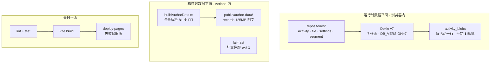
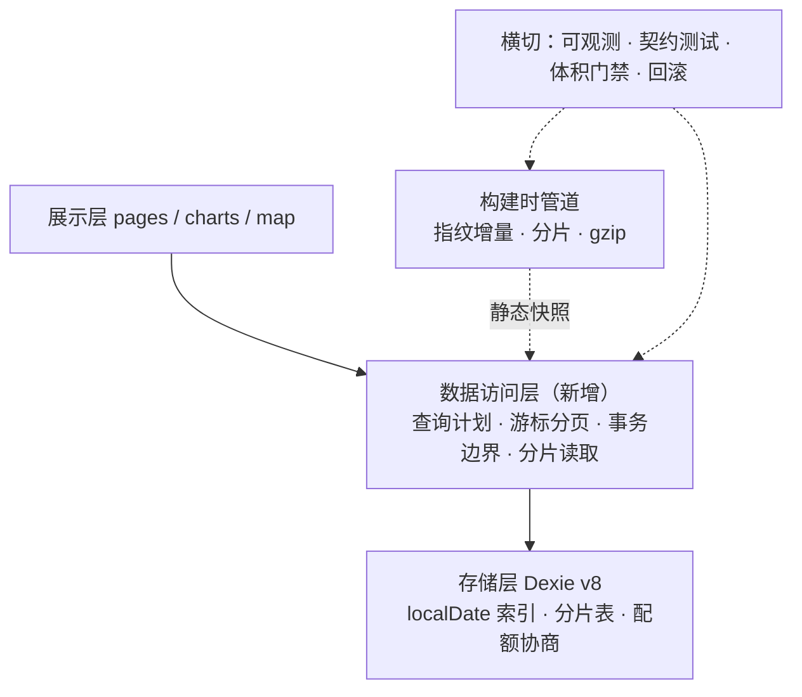

# 数据层重构方案

> **状态**：待评审（2026-09-16 提出，对应版本 2.90.0）
> **适用范围**：本项目的「等效后端层」——运行时数据平面（Dexie/IndexedDB）、构建时数据平面（快照管道）、交付平面（Actions → Pages）
> **前提澄清**：本项目是纯前端 SPA，**没有服务器后端**。数据全在浏览器 IndexedDB，静态产物托管 GitHub Pages，AI 走 BYOK 浏览器直连。因此「后端重构」在本项目等价于：**把数据访问这一层真正立起来**，而不是上微服务。
> **本方案只做设计，未改动任何代码。**

## 1. 结论摘要

现状不是"架构错了"，而是"数据访问层缺位"：UI 直接依赖 Dexie 的具体表结构，查询策略散落在 repository 内部，构建管道无增量。由此产生三类问题：

| 维度 | 现状 | 目标 |
| --- | --- | --- |
| 查询 | 列表页 `toArray()` 全量后内存过滤排序，分页是"取全量再切" | 索引预筛 + 候选集内存精筛，真游标分页 |
| 逐点读取 | `activity_blobs` 整活动一行，读 100 点要反序列化 1.5MB | 分片存储，按需取片 |
| 写入 | 批量导入 N 文件 = 2N 次独立事务，摘要与台账非原子 | 批量事务，单一原子边界 |
| 构建 | 每次 push 全量重解析 + 重写 125MB 明文产物 | 指纹增量 + 分片 + 压缩 |
| 容错 | 流式无超时、配额无协商、降级无恢复 | 显式超时/退避/降级/恢复 |
| 观测 | 错误仅落本机 IndexedDB，线上不可见 | 本地留档 + 可选匿名上报（默认关） |

**投入产出最高的一件事**：`activity_blobs` 分片 + 列表复合索引。它同时解决详情页 IO、热力图内存峰值、列表首屏三条路径。

## 2. 现状：三个数据平面



### 2.1 瓶颈清单（含证据）

| # | 位置 | 问题 |
| --- | --- | --- |
| 1 | `src/storage/repositories/activityRepository.ts:632` | `listActivities` 调 `activities.toArray()` 全量，再交给 `queryActivityList`（`:360`）在内存 filter+sort+slice |
| 2 | `src/storage/db.ts:456` | schema 仅 `id, &fingerprint, startTime, activityType`，**无复合索引**，8 个排序字段 + 12 个数值区间筛选全部走内存 |
| 3 | `activityRepository.ts:580-628` | `getRecordsByActivityIds` 一次 `bulkGet` 拉全部活动的整条 blob（热力图/路线图/赛段路径），无分片无游标 |
| 4 | `activityRepository.ts:561-566` | `getRecords` 主键 get 整行后 `slice(offset, limit)` —— **分页不减少 IO**，10 万点 = 一次完整结构化克隆 |
| 5 | `src/features/import/importer.ts:249,251` | 每文件两次独立事务（摘要、台账）非原子；已实现的批量 `addActivities`（`:523`）**零调用点** |
| 6 | `src/storage/recordsMigration.ts:114-126,167-168` | 抢锁是「读→写」非 CAS；`activity_records.clear()` 与 `writeState('done')` 不在同一事务 → 中途失败可致**真实数据丢失** |
| 7 | `scripts/buildAuthorData.ts:114-169` | 零增量；产物明文未 gzip 未分片（125MB）；`author-data/segments.json` 不存在却被 `SegmentsPage.tsx:207` 静默吞掉 |
| 8 | `src/features/ai/aiClient.ts:404-586` | 流式无首字节/静默超时（`:362` 注释自认），全库无 retry/backoff，`:61` 的 `timeoutMs` 是死参数 |
| 9 | `src/map/CachingTileLayer.tsx:163`；`src/map/tileSources.ts:30` | 未调 `navigator.storage.estimate()`；QuotaExceeded 被吞后每张瓦片重复失败写库；降级计数无时间窗口且本会话不可回退 |
| 10 | `.github/workflows/deploy.yml` | 无 e2e、无产物体积门禁、无依赖扫描、无回滚；`errorLog.ts` 日志仅本机，线上故障不可观测 |

附带两处一致性问题：`db.ts:477` 注释称 v7 物理删除 `activity_records`，实际 `:489` 只加了 `error_logs`，注释与实现不符；`insightCache.ts` 的 key 不含 model，换模型后命中旧文案。

## 3. 目标架构

核心是引入一层 **数据访问层（Data Access Layer）**，让 UI 不再知道数据怎么存：



### 3.1 四条设计原则

1. **领域契约不变**：`src/types/activity.ts` 与 `ActivityRecord[]` 是唯一跨层契约。存储布局可以换（整行 → 分片 → 列式），但重组为 `ActivityRecord[]` 的责任收敛在 repository 内部，UI 不感知。
2. **索引降级必须显式**：新增索引需回填，回填完成前不可用。查询路径必须能探测"索引是否就绪"并回退到全量扫描，不能假设索引一定在。
3. **内存过滤不是原罪，无界才是**：任意组合的数值区间筛选建索引也覆盖不了，正确做法是**先用索引把候选集从 N 降到远小于 N，再在候选集上内存精筛**——而不是追求"零内存过滤"。
4. **数据不出本机是地基**：任何改造都不得让 GPS 轨迹点、逐点序列、API Key 离开浏览器。可观测性上报同理。

## 4. 关键设计决策

### D1 · 列表查询：索引预筛 + 候选集精筛

`queryActivityList`（`activityRepository.ts:360`）目前是全量 `toArray()` 的纯函数，**好处是可测、语义明确**，改造要保住这个性质：

- 保留 `queryActivityList(all, options)` 纯函数，作为**最终一致性基准**与测试 oracle
- 新增 `listActivities` 快路径：先用索引取候选集 / 直接索引分页，再复用同一套过滤逻辑
- `planActivityQuery(options, { localDateIndexReady })`（纯函数）：决定走 `index-startTime` / `index-localDate` / `full-scan`

**三条路径的判定**：

| 策略 | 条件 | 做法 |
| --- | --- | --- |
| `index-startTime` | ① 无年/月筛选 ② 无任何内存专有筛选 ③ `sortBy === 'startTime'` ④ `limit > 0` | `orderBy('startTime')` 游标 + `offset/limit`，只读当前页；`total` 用 `count()` |
| `index-localDate` | 有年/月筛选且 `localDate` 索引已就绪 | `where('localDate').startsWith(prefix)` 取候选集，再交 oracle 精筛 |
| `full-scan` | 其余全部组合 | `toArray()` + oracle（结果永远与索引路径一致） |

**空值口径必须两处一致**：`planActivityQuery` 与 `queryActivityList` 对「空串/纯空白算不算筛选」的判断必须相同，否则会出现「规划器以为无筛选走了索引分页、oracle 以为有筛选」的错配，结果是分页内容对但 total 或顺序错。实施时抽了 `hasInMemoryOnlyFilters` 并补了针对性用例。

**排序同值兜底（实施时新增的必要项）**：`queryActivityList` 的排序补了「同值按 id 比较、方向与主排序一致」的兜底。原因：IndexedDB 索引倒序扫描时同键按**主键倒序**返回，而内存排序原本保留插入序（即主键升序），存在同值行时两条路径会给出不同的页序——不补这层，一致性测试会随机飘。`startTime` 精度到秒（FIT 起跳时间整秒），同值并非不可能，属真实边界。

**为什么数值区间筛选不建索引**：12 个字段任意组合，建 6 个单列索引也覆盖不了 `minDistance AND maxElevationGain AND minAvgPower` 这类组合；且这些条件选择性通常不高。索引只能做"预筛"，精筛仍在内存——这是刻意的取舍，不是遗漏。

### D2 · 新增 `localDate` 字段与索引

年/月筛选当前用 `localDateKeyFromIso(a.startTime)` 按**用户本地时区**的日期前缀匹配（`activityRepository.ts:391,394`），而 `startTime` 是 **UTC ISO 字符串**（`normalizer.ts:110` 由 `toISOString()` 产出），索引比较等价于 UTC 字典序——**本地日期与 UTC 日期在时区边界上不等价**（UTC 8-31 23:30 在东八区已是 9-1），这是必须新开字段而非复用 `startTime` 索引的原因。

v8 schema 变更（**实际落地版**）：

```ts
this.version(8).stores({
  activities: 'id, &fingerprint, startTime, activityType, localDate',
});
```

**为什么最终没有加 `[activityType+startTime]` 复合索引**（方案初稿列了，实施时砍掉）：库里 `activityType` 存的是各平台**原始写法**（`road_biking`、`骑行`），而筛选传入的是**归一化后**的值（`cycling`）。复合索引只能命中字面量相等的行，会静默漏掉其余写法——这比不走索引更糟（结果错了还不报错）。类型筛选继续由内存精筛负责。**索引只做它擅长的事**。

**回填策略**：升级事务内**不做**异步重算（会长时间阻塞 `db.open()`，v5 已为此踩过坑）。落地为 `src/storage/localDateBackfill.ts`：
- 导入路径写入时由 `toActivityEntity` 同步填 `localDate`
- 存量数据启动后**以主键游标单次全表扫描**分批补齐（不用「反复筛缺失行」的写法——`startTime` 非法的行永远补不上，会导致死循环）
- 设置里记 `localDateIndexReady` 标志；**未就绪时年/月筛选走全量路径**，不做「索引一定在」的隐式假设

**同源原则**：`queryActivityList`（oracle）的年/月与日期区间筛选改为优先读摘要上已存的 `localDate`，缺失才按 `startTime` 现算。否则会出现「索引按存储值筛、内存按当前时区重算」，用户跨时区后同一次查询在两条路径上给出不同结果。

**快照刻意不写 `localDate`**：那个值会在 CI 机器的时区下算出来，与访问者本地时区不符，反而污染口径；快照路径始终回退现算。

### D3 · 逐点数据分片

现状 `activity_blobs` 每活动一行、records 为对象数组（`db.ts:425`，`activityRepository.ts:518`）。分片后（**建表落在 v9**——v8 已被 `localDate` 索引占用，改 store 走独立版本才能单独回滚）：

| 项 | 设计 |
| --- | --- |
| 表 | `activity_chunks`，主键 `[activityId+seq]`，另加 `activityId` 单索引供级联删除/按活动扫描 |
| 片大小 | 2000 点/片（由 §6.3 实测选定，见该节的对比表） |
| 读取 | `getRecords(id, offset, limit)` 只取覆盖 `[offset, offset+limit)` 的片；顺序扫描类场景（热力图）按片流式迭代，不一次 bulkGet |
| 写入 | 导入时按片 `bulkPut`，仍在单一事务内；**不双写** `activity_blobs`（理由见下） |
| 兼容 | 读优先级 `activity_chunks` → `activity_blobs` → `activity_records`；后两者只作迁移兜底源，由启动后台任务按活动「写全部分片 + 删源行」同事务替换 |
| 契约 | 对外仍是 `ActivityRecord[]`，重组逻辑在 repository 内部 |

**为什么按活动原子替换而不是双写**：纯前端应用的存储配额是硬约束，翻倍不可接受。代价是「降级到更早版本后轨迹不可见」（数据没丢，是旧代码没有读取路径），记入 §8 风险登记册。

**可选增强（不在 P1 范围）**：片内存列式 `Float32Array`（lat/lon/ele/hr/power/cad/time 各一列），体积与反序列化耗时可再降数倍。代价是要动 `ActivityRecord` 构造链路，影响 1600+ 用例，**单独评估后再决定**。

### D4 · 写入事务边界

- 导入改调已就绪的 `addActivities`（`activityRepository.ts:523`），一批一个事务
- 摘要与 `files` 台账收敛进**同一事务**，消除"活动写成功、台账失败 → 重复导入"窗口
- `clearTypeConfirmations`（`:679-688`）的 N 次单条 `await modify()` 改为单事务批量

### D5 · 迁移与锁的正确性

`recordsMigration.ts` 三处必修：
1. 抢锁改 CAS（利用 IndexedDB 事务的原子性，在同一读写事务内检查 + 写入）
2. 心跳在批内也续期，避免"单批慢于 15s 被误判崩溃"
3. `activity_records.clear()` 与 `writeState('done')` 收敛进同一事务

分片迁移（D3）复用同一套机制，但**必须先修完上面三条再接入**，否则会放大数据丢失风险。

### D6 · 外部依赖容错

| 场景 | 设计 |
| --- | --- |
| AI 流式 | 首字节超时 15s；后续无新字节 20s 判静默超时；两者都走既有 `AbortController`。retry 最多 2 次、指数退避 500ms/2s，**仅对 429/5xx/网络错误**，不重试 4xx 业务错误 |
| AI 死参数 | `ChatCompleteOptions.timeoutMs`（`aiClient.ts:61`）要么实现要么删除，不留声明未用的接口 |
| 瓦片配额 | 启动调 `navigator.storage.estimate()`，动态下调硬编码 100MB 上限；写入抛 QuotaExceeded 即本会话**关闭缓存写入**（避免每张瓦片重复失败写库） |
| 瓦片降级 | 失败计数改为**时间窗口**（如 60s 内累计 3 次）；降级后允许在网络恢复/切换页面时做一次恢复探测 |
| AI 缓存 | `insightCache` 的 key 加入 model 标识；读写改节流批量，避免每次调用全量 `JSON.stringify` localStorage |

### D7 · 可观测性与隐私红线

- 本地：`error_logs` 表（v7 已有）继续作为唯一留档入口，补齐路由级 ErrorBoundary 上报
- 线上：**默认关闭**；如需开启，必须由用户在设置里显式授权
- **红线**：上报内容只允许错误类型、堆栈摘要、版本号、聚合计数。**严禁**携带 GPS 轨迹点、逐点序列、文件名、API Key。此约束与 AI 红线第②条同源，写进代码注释与评审 checklist

### D8 · 构建时管道增量

| 项 | 现状 | 目标 |
| --- | --- | --- |
| 解析 | 每次全量重解析 81 个 FIT | 指纹（已有内容哈希）+ mtime 缓存，只解析变了的 |
| 产物 | `records/<fingerprint>.json` 明文 125MB | 按年分片 + gzip；前端按年懒加载 |
| 失败 | 任一 FIT 失败 `exit 1` | skip-and-warn：坏文件跳过并告警，保留上一版好快照；只有"全部失败"才 fail |
| 缺失数据 | `segments.json` 不存在被 `.catch(() => ({}))` 吞掉 | 缺失即告警，不允许静默少数据 |
| git | `tiles/` 18MB 二进制进库 | 移出 git，改由构建生成或走 release 资产 |

## 5. 分阶段路线图

### P0 · 止血（不改结构，5 项独立小修）

| # | 改动 | 验收标准 |
| --- | --- | --- |
| P0-1 | AI 流式首字节/静默超时 + retry 退避 | 断网/挂起服务端下，UI 30s 内给出可操作错误态，不永久卡在"正在生成"；单测覆盖超时与退避次数 |
| P0-2 | 瓦片配额协商 + 写失败熔断 + 降级时间窗口 | 模拟 QuotaExceeded 后不再重复写库；弱网抖动不会长期停在白图；单测覆盖计数窗口与恢复探测 |
| P0-3 | 迁移锁改 CAS + 清理与状态同事务 | 并发双标签不重复迁移；注入中途失败后旧表数据仍完整（回归测试） |
| P0-4 | 导入改批量事务（调 `addActivities`）+ 摘要台账同事务 | 导入 50 个 FIT 时事务数从 ~100 降到个位数；注入台账写失败后活动不落库 |
| P0-5 | 修 `db.ts:477` 注释与实现不符；`segments.json` 缺失改显式告警 | 文档与代码一致；缺失数据不再被静默吞掉 |

**回滚**：每项独立提交，可单独 revert；均不改 schema，无数据迁移风险。

### P1 · 立起数据访问层

| # | 改动 | 验收标准 |
| --- | --- | --- |
| P1-1 ✅ | `planActivityQuery` 查询规划器 + v8 `localDate` 索引与回填 + 索引分页 | 已落地（v2.91.0）：无筛选列表走 `startTime` 索引游标分页；年/月筛选走 `localDate` 索引；oracle 一致性用例覆盖同值行与未就绪回退 |
| P1-2 ✅ | `activity_chunks` 分片（v9）+ `getRecords` 按片范围读取 + 后台分片迁移 | 已落地（v2.92.0）：**导出放大 11.00x → 1.00x**（§6.2 场景 D）；详情页读 100 点从 100,000 点/15.4MB 降到 2,000 点/315KB（50x）；分片边界与区间换算有独立单测，全量读取结果与旧布局逐点相等 |
| P1-3 | 热力图/路线图/赛段改按片流式迭代 | 1000 活动扫描时不再一次性 `bulkGet` 全部 blob；峰值内存下降可测量（Chrome performance.memory 或 CDP）。⚠️ **分片本身不降低本项总量**（§6.2 场景 C 仍为 154MB），必须改调用点才有效 |
| P1-4 ✅ | ErrorBoundary 下沉到路由级与地图区块级 | 已落地（v2.91.1）：新增 `variant="section"` 内联降级 + `SectionBoundary` / `RouteBoundary`（按 pathname 自动重置），接到内容区与两个地图区块；单个区块报错不再整页降级 |
| P1-5 ✅ | SW `html-shell` 加条目上限；激活时清理旧版本自有缓存 | 已落地（v2.91.2）：策略抽到 `src/swCache.ts` 便于单测；写入后按插入序裁剪到 20 条；清理只限本应用自有前缀（同源 CacheStorage 共享，不能无差别删） |

**回滚**：v8 升级为加索引、v9 为加表（均不删表不改列），旧版应用打开同一库功能不受影响。⚠️ **但 v9 起逐点数据的读取路径变了**：分片迁移按活动原子替换（写分片 + 删源行），因此**降级到更早版本后轨迹会读不出来**——数据完整保存在 `activity_chunks`，丢的是旧代码的读取路径。紧急回滚的正确做法是发布「能读 chunks」的补丁版本，而不是退回更早的 tag；本条须在发布说明中告知（同 §8）。

### P2 · 构建与交付演进

| # | 改动 | 验收标准 |
| --- | --- | --- |
| P2-1 | 快照指纹增量构建 | 只改动 1 个 FIT 时，构建耗时显著低于全量（基线需先测一次全量） |
| P2-2 | 产物按年分片 + gzip | `public/author-data/records` 体积下降一个数量级；前端按年懒加载，首屏不由全量 manifest 阻塞 |
| P2-3 | fail-fast 改 skip-and-warn | 注入坏 FIT 后构建仍成功并告警；坏文件不计入快照 |
| P2-4 | CI 加产物体积门禁、`npm audit`、e2e | 体积超阈值/高危漏洞/e2e 失败即阻断发布 |
| P2-5 | 可选匿名错误上报（默认关） | 未授权时零外发（用网络断言测试证明）；授权后上报体不含任何轨迹数据（payload 快照测试） |

## 6. 验收基线（已实测，2026-09-16）

复现命令：`npm run bench:data-layer`（另有 `--scale=small|default|large`）。脚本 `scripts/bench-data-layer.ts`，全部使用合成数据，**严禁使用 `private-fixtures/` 真实骑行数据**。

### 6.1 口径说明（先读，否则数字会被误读）

- **主口径 = IndexedDB 实际解出的行数 / 点数**，用 Dexie 的 `hook('reading')` 计数（对象已解出、即将交给调用方时触发）。这是环境无关的硬指标，同时决定反序列化开销与峰值内存。
- **耗时不可外推**：脚本跑在 fake-indexeddb（纯内存）上，与真实浏览器（磁盘 + 结构化克隆 + IPC）无可比性，仅作同进程内相对参考。
- **字节数由 JSON 长度估算**（合成数据同构，单点 ≈ 161.5 B），它**高估**真实 IndexedDB 占用——IDB 用结构化克隆存储，不重复字段名。该值只用于横向比较，不代表磁盘占用。

### 6.2 实测数字（`scale=default`）

| 场景 | 现状解出 | 耗时* | 结论 |
| --- | --- | --- | --- |
| **A 列表** 1000 活动 | | | |
| 　`toArray()` 全量（改造前对照） | 1000 行 | 9.3ms | — |
| 　`listActivities({limit:50})` 首页 | **50 行** | 2.3ms | P1-1 已达成：解出行数降 20x |
| 　…`offset=500` 中页 | 50 行 | 13.3ms | 解出行数不随页深增长 |
| 　…`offset=950` 尾页 | 50 行 | 29.0ms | 但 `advance` 遍历代价随 offset 线性上升 |
| **B 详情页** 单活动 10 万点 | | | |
| 　`getRecords(id,{limit:100})` | **100,000 点**（15.4 MB） | 197ms | 与全量**完全等价**，分页零收益 |
| 　`getRecords(id)` 全量 | 100,000 点（15.4 MB） | 205ms | 单次结构化克隆 15.4 MB，主线程阻塞 |
| **C 批量扫描** 500 活动 × 2000 点 | | | |
| 　`getRecordsByActivityIds(全部)` | **1,000,000 点**（154 MB） | 1997ms | 峰值内存 = 全部逐点，iOS 上必被杀 |
| **D 导出分批** 单活动 10 万点，批大小 1 万 | | | |
| 　`iterateRecordBatches`（11 次调用） | **1,100,000 点**（169 MB） | 2260ms | **放大 11 倍**——不是不省，是白读 |

\* 耗时列仅供相对比较，见 §6.1。

### 6.2b P1-2 落地后对照（v9 分片，2026-09-16 实测）

同一命令、同一规模（`scale=default`）、同一口径，仅存储布局改为 2000 点/片：

| 场景 | 分片前 | 分片后 | 倍数 |
| --- | --- | --- | --- |
| A 列表 首页 `limit=50` | 50 行 | 50 行 | 不变（列表本就不读逐点） |
| B 详情页 `getRecords(id,{limit:100})` | 100,000 点 / 15.4 MB | **2,000 点 / 315.5 KB** | **50x ↓**（只解出覆盖区间的那一片） |
| B 详情页 `getRecords(id,{offset:中段,limit:100})` | 100,000 点 | **2,000 点** | 50x ↓（不随偏移退化） |
| B 详情页 `getRecords(id)` 全量 | 100,000 点 | 100,000 点（50 片） | 不变（图表本就需要全量点） |
| C 批量扫描 `getRecordsByActivityIds(500)` | 1,000,000 点 / 154 MB | 1,000,000 点 / 154 MB | **不变** —— 见下方说明 |
| D 导出分批（11 次调用） | 1,100,000 点 / 169 MB（**11.00x**） | 100,000 点 / 15.4 MB（**1.00x**） | **放大消除** |

**场景 C 为什么没变**：`getRecordsByActivityIds` 的返回值契约就是 `Map<活动, 全量记录>`，分片只降低单次调用的读取粒度，不改变返回值总量。要降这一项必须改调用点（P1-3）。本表保留该行正是为了**证伪**「上了分片批量扫描就自动变好」的错觉。

**片大小 2000 的复核**：详情页读 100 点时解出 2000 点（20x 溢出）；若用 5000 点/片则是 5000 点（50x 溢出）。导出场景两者接近（2000 点片跨 5~6 片 ≈ 1.9MB，5000 点片跨 2~3 片 ≈ 2.4MB）。**结论：维持 2000。**

### 6.3 由数字得出的三个判断

**① P1-1 的列表优化已达标，不需要 keyset 分页。** 解出行数从 1000 降到 50（20x），首页 2.3ms。尾页 29ms 的代价来自 IDB `advance` 遍历索引条目（不解对象），在千级活动下可接受。**结论：不引入 keyset 分页**——活动数上万时再评估，避免为不存在的规模做优化。

**② 分片（P1-2）的第一收益方不是详情页，而是导出与批量扫描。** 详情页无论如何都要读全量点（图表需要），分片对它是"降峰值"而非"减总量"。真正的重灾区是：

- **导出路径放大 11 倍**（场景 D）：`exportImport.ts:444` 按 offset 递增分批，而 `getRecords` 每次整行读出后 `slice`——10 万点活动导出要做 11 次全量反序列化。分片后每次只读覆盖区间的片，总量回落到 **≈1.0x**。**这是本次重构收益最大、风险最低的一处。**
- **批量扫描 154 MB 峰值**（场景 C）：6 处调用点（热力图 / 路线图 / 赛段页 / 赛段详情 / 赛段创建 / 赛段推荐）全部整批拉取。分片 + 按片流式迭代后峰值降到单片量级。

**③ 片大小定为 2000 点**（原方案写的 5000 已下调，依据如下）：

| 关注场景 | 片 5000 | 片 2000 |
| --- | --- | --- |
| 详情页读 100 点 | 解 5000 点 ≈ 0.8 MB（19x↓） | 解 2000 点 ≈ 0.32 MB（**48x↓**） |
| 导出批 1 万点 | 跨 2–3 片 ≈ 2.4 MB | 跨 6 片 ≈ 1.9 MB |
| 批量扫描峰值 | 0.8 MB | **0.32 MB** |
| 典型活动（3600–10800 点） | 1–3 片 | 2–6 片 |

两者在导出场景几乎持平，而 2000 点在详情页与扫描峰值上明显更好；片数增加带来的写放大有限（单活动最多几十片，且导入已是批量事务）。

### 6.4 未补测项

第 ④ 项（导入事务数）已在 P0-4 交付中通过结构调整解决（一批一事务），无需单独基线；第 ⑤ 项（构建耗时/产物体积）属 P2，届时随构建管道改造一并测。


## 7. 明确不做

1. **不上服务器和数据库**。数据不出本机是产品核心卖点，也是 AI 三条红线的地基。加后端会同时拆掉隐私承诺、BYOK 零成本托管，换来的多端同步目前无需求。
2. **不引入 ORM / 查询构建器**。仓库就 7 张表，多一层抽象只会让"哪些查询走索引"更不透明——而这恰恰是本次要解决的问题。
3. **不做虚拟滚动**。现有证据指向**内存峰值**（blob 整读）而非渲染行数。先用基线数据量化，别在错误的方向上优化。
4. **不做列式存储（P1）**。收益大但影响 `ActivityRecord` 构造链路与 1600+ 用例，等分片落地、基线清晰后再单独评估。
5. **不做多端同步 / 账号体系**。与第 1 条同源。

## 8. 风险登记册

| 风险 | 影响 | 缓解 |
| --- | --- | --- |
| v8 升级触发老用户 blocked/versionchange 流程 | 老用户首访被打断 | 沿用 v7 已有的 blocked 提示与 versionchange 自动放行；升级事务内不做重活 |
| `localDate` 回填期间索引不可用 | 查询回退全量，退化到现状 | `localDateIndexReady` 标志 + 显式回退路径，不做隐式假设 |
| 分片迁移中途失败 | 逐点数据不完整 | 必须先完成 P0-3（CAS 锁 + 同事务清理）再启动；迁移**按活动原子替换**（写该活动的 chunks 与删该活动的 blobs 在同一事务内），任一活动要么完整在新表、要么完整在旧表，不存在「半个活动」 |
| **降级到旧版本后轨迹不可见** | 紧急回滚时旧代码读不到 `activity_chunks`，详情页/地图显示空轨迹 | 数据本身不丢（完整存于 `activity_chunks`），丢的是旧代码的读取路径。缓解：① PWA `autoUpdate` 使客户端不会长期停在旧版本；② 回滚应发布「能读 chunks」的补丁版本，而非退回更早 tag；③ **本条须在发布说明中明确告知**——这是分片方案唯一的实质性代价 |
| 时区/本地日期语义变更 | 年/月筛选结果变化 | `queryActivityList` 作为 oracle 的新旧一致性测试，覆盖跨时区与东八区边界（沿用 2.51.12 的东八区回归用例） |
| 分片大小选择不当 | 小活动片数过多 / 大活动单片仍过大 | 已按 §6.3 实测对比选定 2000 点；分片布局不进入对外契约（`ActivityRecord[]` 不变），调整片大小只需重跑迁移，不需改调用方 |
| 可观测上报泄露轨迹 | 违反隐私红线 | 上报 payload 快照测试断言不含轨迹字段；默认关闭 |
