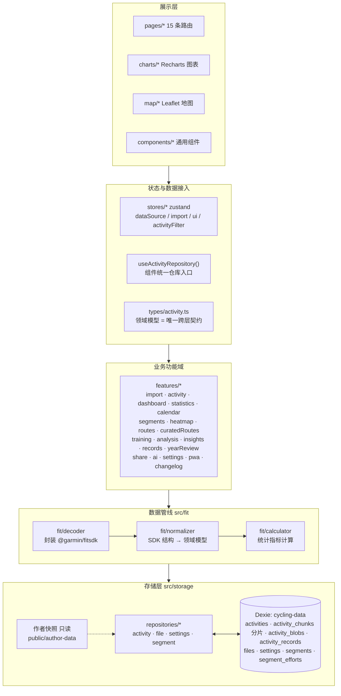
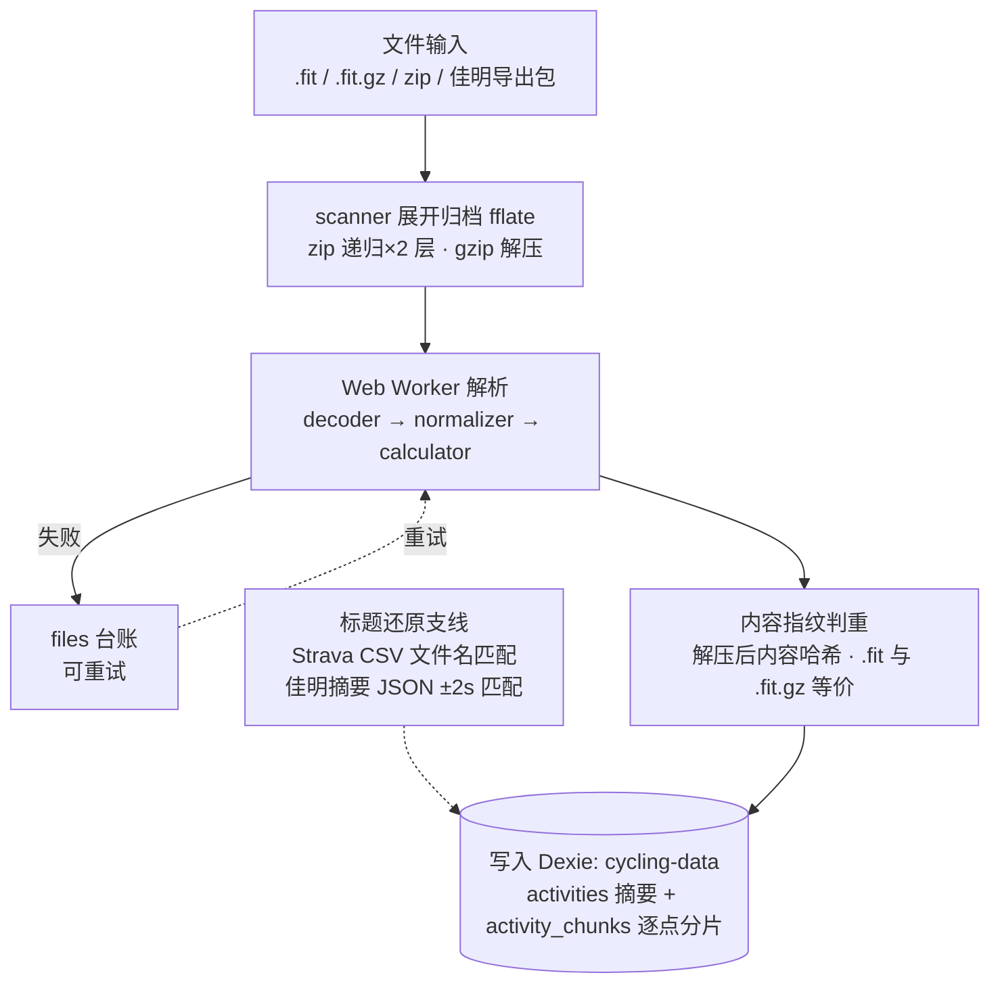
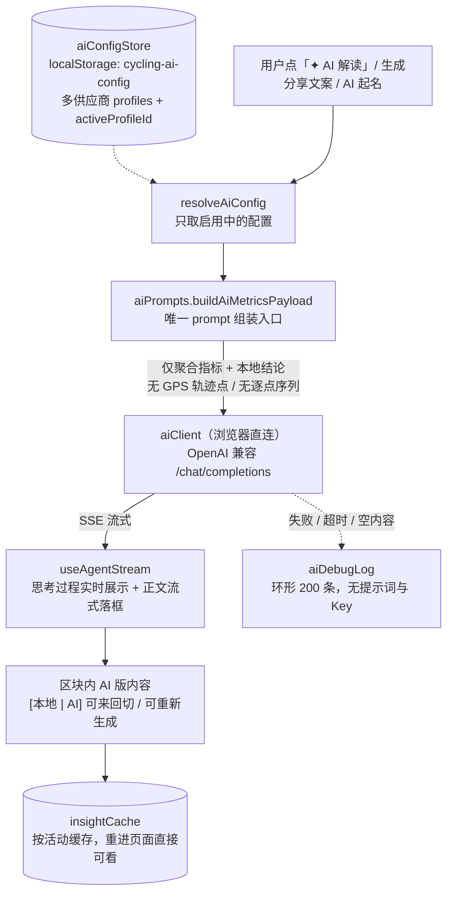
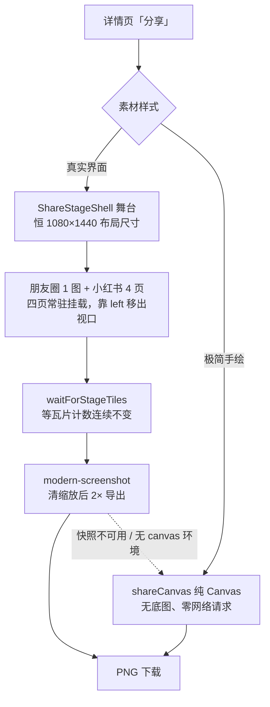

# 架构总览

> 个人骑行数据分析网站（Strava Lite）的整体架构说明。产品规格出处见《个人骑行数据分析网站——Agent 开发规格说明》，功能状态清单见 `PROGRESS.md`，开发约定见根目录 `CLAUDE.md` / `AGENTS.md`。
>
> 更新日期：2026-09-16（对应版本 2.93.0）

## 1. 一句话概括

纯前端单页应用：FIT 文件**在浏览器内**解析，数据存 **IndexedDB**，部署在 **GitHub Pages**；默认展示作者公开数据快照（只读），访客也可导入自己的数据（本地可写）——**双数据源**。AI 能力采用 **BYOK**（用户自带 Key，浏览器直连服务商，无后端代理），分享出图与视频导出全部在本机完成。

## 2. 技术栈

| 类别 | 选型 |
| --- | --- |
| 框架 | React 19 + TypeScript（strict） |
| 构建 | Vite（rolldown，`tsc -b` 类型检查 + vite build），vite-plugin-pwa（injectManifest + 自研 `src/sw.ts`） |
| 路由 | react-router-dom 7（生产 basename `/cycling-analyzer`，dev `/`） |
| 状态 | zustand 5（`src/stores/*`，4 个 store） |
| 持久化 | Dexie 4（IndexedDB 封装，库名 `cycling-data`，`DB_VERSION = 9`） |
| FIT 解析 | @garmin/fitsdk（仅在 `src/fit/decoder` 内出现） |
| 图表 | Recharts 3（路由懒加载 + 独立 chunk） |
| 地图 | Leaflet + react-leaflet 5；**默认高德 GCJ-02 瓦片**，OSM 仅作可用性兜底 |
| 压缩 | fflate（zip/gzip，导入扫描与快照构建共用） |
| 出图 | modern-screenshot（分享卡，动态 `import()`，仅打开分享弹窗时下载）、Canvas 自绘 |
| AI | BYOK：浏览器直连服务商 OpenAI 兼容 `/chat/completions`（SSE 流式） |
| 测试 | Vitest + jsdom + fake-indexeddb + Testing Library；Playwright（e2e 冒烟，已进 CI） |

## 3. 分层架构（硬边界）



**硬约束（规格 §42）**：

- React 组件**禁止**直接调用 `@garmin/fitsdk`；UI 只依赖 `src/types/activity.ts` 领域模型与 repository 接口
- 单位固定：米 / m/s / bpm / rpm / W、Unix 秒、十进制度；**缺失字段 = undefined ≠ 0**，UI 显示 `—`
- 组件不自己 new 仓库，统一经 `useActivityRepository()` 取当前数据源的仓库；作者源只读，写操作 UI 按源隐藏
- **AI 三条红线**：① API Key 只存 localStorage 独立 store（`aiConfigStore`，键 `cycling-ai-config`），**绝不入 Dexie settings 表**（该表会被「导出数据」整表写进备份 JSON）；② 上行数据只有聚合指标，**GPS 轨迹点与逐点序列绝不出本机**（`aiPrompts.buildAiMetricsPayload` 是唯一 prompt 组装入口）；③ 未配置且未启用任何供应商时全部 AI 入口不渲染；AI 文案只是填入编辑框的草稿，可改可清
- **运动类型归一化**：判断是否骑行一律用 `types/activityType.ts` 的 `isCyclingType()`，禁止在业务代码里比 `=== 'cycling'`（库里可能存有 `road_biking`、Strava 中文「骑行」等原始写法）；分析类页面取数必须走 `listCyclingSummaries(repository)`，且过滤要发生在 `summariesScanKey()` 之前（否则会永久命中混了非骑行轨迹的缓存）
- **底图合规**：面向用户的主底图只用合规白名单（腾讯 / 高德 / 百度 / 天地图）；OSM 系仅作可用性兜底，境外服务（OpenTopoMap / Google / Bing / Mapbox）不作主底图
- **运动时间口径单一来源**：`features/activity/movingTime.ts` 是「相邻点是否在运动中」的唯一判定处，`fit/calculator.estimateMovingDuration` 与 `map/replayCore.buildMovingTimeline` 共用，禁止各自复制阈值

## 4. 目录结构

```
src/
├─ main.tsx            # 入口：路由 basename、主题/侧边栏/统计口径恢复、数据源探测、旧底图模式键清理、发版兜底刷新
├─ app/                # App 壳、router.tsx（ROUTES 常量，15 条）
├─ pages/              # 15 个页面组件：仪表盘 / 活动列表 / 活动详情 / 统计 / 日历 / 设置（更多） /
│                      #   热力图 / 路线图 / 赛段 / 赛段详情 / 年度回顾 / 训练计划 / 表现 / 更新日志 / 致谢
├─ features/           # 业务功能域（页面级逻辑 + 纯函数计算），见下表
├─ components/         # 跨页面通用组件（数据源切换、迁移横幅、更新提示、反馈入口、错误边界等）
├─ charts/             # Recharts 封装（指标图、功率曲线、降采样、坐标轴、时间轴联动）
├─ map/                # Leaflet 封装：瓦片源与降级、底图模式、轨迹回放、路线配色、轨迹简化、全屏、本地瓦片缓存
├─ stores/             # zustand：数据源 / 导入 / UI / 活动筛选
├─ hooks/              # useActivityRepository、单位格式化、PWA 安装、useInView 等
├─ types/              # activity.ts 领域模型（唯一跨层契约）、activityType.ts（类型归一化）
├─ fit/                # 数据管线：decoder / normalizer / calculator / worker（Web Worker）
├─ geo/                # 坐标系转换（WGS-84 ↔ GCJ-02）与投影
├─ gpx/                # GPX 解析（导出与导入复用）
├─ storage/            # Dexie db.ts、repositories、作者快照客户端、瓦片缓存、扫描缓存、逐点分片与两层迁移
└─ utils/              # 指纹、格式化、导航
```

`src/features/` 功能域一览（19 个）：

| 域 | 职责 |
| --- | --- |
| `import` | 文件/zip/佳明导出包扫描展开、Worker 解析客户端、Strava CSV 标题还原、错误分类 |
| `activity` | 详情页各区块：分段/爬坡/成就/对比/训练效果/相似骑行/轨迹清洗/GPX 导出/回放视频导出 |
| `analysis` | 跨活动分析：强度、区间、功率曲线、FTP 估算、训练状态、表现趋势、有氧效率、质量分 |
| `ai` | BYOK 接入：供应商预设与配置 store、prompt 组装、流式客户端、请求缓存、诊断日志、AI 解读区块 |
| `share` | 分享素材：真实界面舞台（1080×1440，朋友圈 1 图 / 小红书 4 页）+ 极简手绘 Canvas，两条出图链路 |
| `statistics` / `dashboard` | 统计页与仪表盘的聚合卡片、趋势图、训练状态、最近骑行 |
| `segments` | 赛段匹配、成绩榜（独立 Worker）、赛段成绩落库、**本地挖掘高频路段推荐** |
| `heatmap` / `routes` | 热力图网格、路线聚类 |
| `curatedRoutes` | 精选热门路线数据（北京 + 全国 16 地区，几何由脚本从 OSM 路网产出） |
| `calendar` / `records` / `insights` | 日历热力图与悬浮详情、个人纪录、骑行洞察与一句话总结 |
| `training` / `yearReview` | 训练计划、年度回顾与分享卡片 |
| `settings` | 主题、侧边栏、有效训练配置 `getEffectiveProfile(source)` |
| `pwa` / `changelog` | SW 更新检测与安装引导；版本更新日志数据与时间线 |

## 5. 导入数据流



要点：

- **解析在 Web Worker**（`src/fit/worker/`），jsdom 测试环境自动降级主线程
- **活动 ID = 文件内容指纹**（解压后哈希），同一活动 `.fit` 与 `.fit.gz` 判重一致，天然支持快照深链
- **Strava 标题还原**：批量导出 CSV 的「文件名」列匹配（跨行引号感知）；佳明 GDPR 导出包按摘要 JSON `startTimeGmt` 与 FIT 开始时间 ±2s 匹配
- 导入期完成运动类型判定（`resolveActivityType`：CSV 类型 > FIT sport > GPX trk type > 速度特征兜底），汇总时给出 `nonCyclingCounts`；**存量修正只读检测 → 用户确认 → 才写入**，不静默改写历史数据
- 失败文件进 `files` 台账，UI 可重试

## 6. 存储模型（Dexie `cycling-data`，`DB_VERSION = 9`）

| 表 | 内容 | 说明 |
| --- | --- | --- |
| `activities` | 活动摘要（含 `normalizedPower`） | 列表/聚合只查摘要；索引 `id, &fingerprint, startTime, activityType, localDate` |
| `activity_chunks` | **逐点数据主存储**（v9）：每活动 N 片 | 复合主键 `[activityId+seq]` + `activityId` 单索引（级联删除用）；片大小 2000 点 |
| `activity_blobs` | v5~v8 的「每活动一行」 | v9 起**只作迁移源，不再写入** |
| `activity_records` | v4 及更早的逐点行表 | 迁移兜底 |
| `files` | 文件台账 | 导入成功/失败记录，失败可重试 |
| `settings` | 用户设置、训练配置 | 训练配置随数据源切换（`getEffectiveProfile(source)`） |
| `segments` | 赛段定义（起终点圆等） | v2 新增 |
| `segment_efforts` | 赛段成绩落库 | v6 新增，替代「每次进赛段页全量重扫」 |

**为什么逐点数据从「整活动一行」改成「分片」**（v9）：整活动一行在**按区间读**时也必须整行解出——
详情页只读 100 点仍要解出全部 10 万点 / 15.4MB，导出按 1 万点/批读 11 次造成 **11 倍**反序列化放大。
分片后按主键范围查询只解出覆盖目标区间的片，两处分别降到 **1/50** 与 **1.00x**。
完整实测数字与取舍见 `docs/数据层重构方案.md` §6。

**逐点读取路径**（`getRecords` / `getRecordsByActivityIds`）：`activity_chunks` → `activity_blobs`
→ `activity_records`；后两级命中时会按**当前**布局回填分片，与后台迁移双向收敛。
对外契约始终是 `ActivityRecord[]`，布局变化不溢出到调用方（重组逻辑在 repository 内部）。

**大范围扫描一律用 `iterateRecordBatches(ids, visit, { batchSize })`**（默认 16 活动/批）：
`getRecordsByActivityIds` 的返回值是 `Map<活动, 全量记录>`，峰值 = 所有活动逐点之和
（实测 500 活动 × 2000 点 = 154MB，iOS 上必被杀），分批流式后峰值 4.9MB。
回调**串行**调用、返回 `false` 可提前终止；**不要在回调里长期持有 batch**，否则退化回全量驻留。

**迁移分两层，共用 `storage/migrationLock.ts`**（CAS 抢锁 + 心跳随处理进度续期 + done 标记）：
`recordsMigration.ts`（v4 逐点行 → v5 整活动行，完成后与标记同事务清旧表）与
`chunksMigration.ts`（v5 整活动行 → v9 分片，每活动「写全部分片 + 删源行」同事务原子替换）。
**锁逻辑必须共用同一份**——这套并发语义写错一次就丢数据，不能复制成两份各改各的。

**索引设计的两个硬约束**（都有踩坑记录）：

- **不要建 `[activityType+startTime]` 复合索引**：库里 `activityType` 存的是各平台原始写法
  （`road_biking` / 「骑行」），筛选传入的是归一化值（`cycling`），复合索引只能命中字面量相等的行
  → **静默漏记录**，比不走索引更糟。类型筛选仍走内存精筛（`isCyclingType`）
- `startTime` 是 **UTC ISO 字符串**（`toISOString()`），字典序即时间序，可直接作排序索引；
  但年/月筛选按**本地**日期匹配，与 UTC 在时区边界不等价，故另存 `localDate` 字段与索引
  （存量行由 `localDateBackfill.ts` 启动回填，未就绪时查询自动回退全量）

⚠️ **逐点数据有三种布局（chunks / blobs / records），测试的 `beforeEach` 必须三种都清**——
只清其一会让上一条用例的数据从兜底路径漏进来（已踩过，见 `memory/data-layer.md`）。

另有无状态缓存两张表：`tile_cache`（离线地图瓦片，LRU 淘汰按写入节流）、`scan_cache`（导入扫描结果）。

**不入 Dexie 的本地存储**：AI 供应商配置 `cycling-ai-config`、AI 解读缓存 `cycling-ai-insight-cache`、AI 诊断日志 `cycling-ai-debug-log`——均独立 localStorage 键，**不随「导出数据」备份文件外流**。

## 7. 双数据源

- `dataSourceStore` 管理两个源：**作者的数据**（CI 构建的静态快照 `public/author-data/`，只读，由 `npm run build:author-data` 全量重建，实测约 7s）与**我的数据**（本地 IndexedDB，可写）；单个坏 FIT 会**跳过并告警**（不再阻塞整站发布），全部解析失败才中止
- 组件统一经 `useActivityRepository()` 获取当前源的仓库（`authorData/authorActivityRepository.ts` 或本地 repository），训练配置随源切换
- 作者源下所有写操作 UI 一律隐藏；快照探测失败（如本地 dev 未生成）静默回退本地源
- **作者数据可见性（v2.48.0）**：`authorVisibility: 'auto' | 'show' | 'hide'`，auto = 本地有活动即隐藏（视为空状态示例），清空本地后自动回来；作者档不可用时切换器整体不渲染
- 跨活动全量扫描类功能（热力图轨迹、赛段成绩榜、功率纪录、路线分组）为构建时预计算产物，访客无需下载全部逐点数据

## 8. 地图与瓦片

- **默认底图为高德 GCJ-02**（合规白名单：腾讯 / 高德 / 百度 / 天地图）；连续 3 张失败且期间无成功时降级 OSM（WGS-84），sessionStorage 记忆（key `cycling-map-tile-fallback`）
- **底图模式三档**（`src/map/tileSources.ts` 的 `MAP_MODES`，均同坐标系，切换不触发轨迹重新投影）：「正常」= 不透明矢量底图 + 路网注记；「卫星」= JPEG 影像无注记；「卫星+路网」= 影像 + 透明注记叠加层
- **底图模式不持久化**（2.63.0 起）：默认恒为「正常」，只在当前页面生效，刷新/换页回正常；旧键 `cycling-map-mode` 启动时清理
- 已移除 OpenTopoMap 地形层（境外服务国内加载不出，且 WGS-84 与底图/轨迹 GCJ-02 错位数百米）；降级到 OSM 后模式按钮置灰
- 高德底图降级后展示坐标统一做 WGS-84 → GCJ-02 转换（境外原样返回，`src/geo/projection`）；轨迹导出视频与建段吸附都在投影坐标系上计算
- **本地预缓存瓦片只服务「正常」模式**：`public/author-data/tiles/` 清单 key 只有 `"z/x/y"`，`allowLocalTile` 必须由 `FallbackTileLayer` 按 `mapMode === 'normal'` 传入，否则卫星模式会混出矢量瓦片
- 出图场景（分享 / 录像）必须给瓦片层传 `crossOrigin`，否则跨域瓦片 `drawImage` 污染画布、`toBlob` 直接抛错

## 9. AI 接入（BYOK，无后端）



- `aiClient` 两个出口（`chatComplete` / `streamChatComplete`）外层统一日志包装，各调用点通过可选 `featureTag` 打标
- 供应商加 `AiVendorPreset.extraHeaders` 声明附加请求头（如 Claude 的 `anthropic-dangerous-direct-browser-access`），`buildHeaders` 统一合并，调用点不手工拼头
- 预设库数据源自 cc-switch（MIT），保持「OpenAI 兼容端点」口径
- 设置 → AI 服务含「诊断日志」折叠面板（只看失败 / 复制 JSON / 清空）

## 10. 分享出图双链路（硬约束：两条都不要删）



关键点：

- 预览缩放只能挂在弹窗插槽的 `transform` 上，**绝不能缩舞台或外层容器的布局尺寸**——Leaflet 的 `getSize()` 读 `clientWidth`，布局被缩会按小视口取瓦片层级，成图糊掉
- 四页常驻挂载必须保留布局，不能用 `display: none` / `visibility: hidden`（前者 Leaflet/Recharts 量不到尺寸，后者会被快照克隆成隐藏）
- 复用站内组件的页面（洞察 = `RideInsightsSection`、图表 = `MultiMetricChart`）只改字号间距，且全部作用域限定在 `.share-stage` 内
- 卡片颜色取语义令牌，成图跟随站点主题

## 11. 路由与部署

- SPA 路由 15 条（`src/app/router.tsx` 的 `ROUTES`）；生产 basename `/cycling-analyzer`，dev `/`
- `/changelog`、`/acknowledgments` 为**兼容旧链接保留的路由**，真实入口已并入设置（「更多」）页的对应区块（`/settings#changelog`、`/settings#acknowledgments`）
- GitHub Pages 部署：`public/404.html` 处理深链接；CI 重建 `public/author-data/` 与 `dist/`
- **CI 结构**（`.github/workflows/deploy.yml`）4 个 job：`verify`（lint + 单测 + `npm audit` 非阻塞）→ `e2e` / `build` 并行 → `deploy`（需两者都过）；`build` 内含**快照体积门禁**（`npm run check:snapshot-size`）
- **回滚**：Actions → Deploy GitHub Pages → Run workflow → `ref` 填上一个正常发布的提交 SHA，重新发布那一版（无需 revert 提交）
- PWA（vite-plugin-pwa，injectManifest + `src/sw.ts`）：SW 更新策略为导航网络优先 + 静默激活；`vite:preloadError` 触发一次自动刷新兜底旧版本懒加载 chunk 404
- 本地不跑 `vite build`：提交前验证走 `npm run check`，构建与全量测试由 CI 兜底（详见 `AGENTS.md`）

## 12. 测试架构

- Vitest + jsdom，`tests/setup.ts` 全局注册 fake-indexeddb；DB 测试用真 Dexie 实例注入；181 个测试文件、1745 用例
- FIT 样例在 `tests/fixtures/`（Garmin 官方公开样例 + 合成 GPS 文件）；**`private-fixtures/` 用户真实数据 gitignored，严禁提交或引用进测试**
- 页面测试用 MemoryRouter；数据加载支持注入；mock `getBoundingClientRect` 让 Recharts 可渲染
- e2e 用 Playwright（2 条冒烟：路由可达 + 深链渲染）；**进 CI 且先构建作者快照**，测的是站点真实的作者模式而非「无快照降级模式」

## 13. 常用命令

```bash
npm run dev                 # 本地开发（5173）
npm run check               # 提交前快速验证（tsc -b + 改动文件 lint + 相关测试，约 30s）
npm run check -- --full     # 全量 lint + 全量测试（大改动 / 排查时）
npx vitest run <file>       # 单文件测试
npm run build:author-data   # 作者快照全量重建（fail-fast）
npm run build               # tsc -b + vite build（本地通常不需要，CI 兜底）
npm run test:e2e            # Playwright e2e（首次需 npx playwright install chromium）
npm run bench:data-layer    # 数据层基线测量（解出行数/点数，--scale=small|default|large）
npm run check:snapshot-size # 作者快照产物体积门禁（阈值与理由见脚本注释）
npm run curate -- --spec <需求单.json>   # 精选路线半自动添加（--dry 试运行）
```
